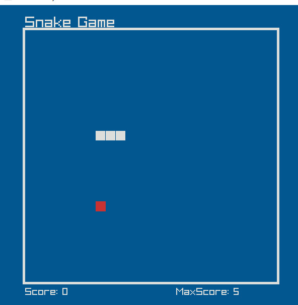

# Snake Game in C++
## Overview
This project is a classic Snake game implemented in C++ using the Raylib library. The game challenges players to guide a growing snake to consume food while avoiding collisions with walls and itself. The snake grows longer with each piece of food consumed, increasing the difficulty as the game progresses.

## Features
- Smooth Snake Movement: The snake moves fluidly in a grid-based system.
- Dynamic Difficulty: The movement speed of the snake increases as the score increases.
- Score Tracking: Displays the current score and the highest score achieved during the session.
- Game Over Mechanics: Resets the game upon collision with walls or itself.
- Clean and Minimalistic Interface: A visually appealing design with custom colors.
- Controls
``` bash
 Arrow Keys: Control the direction of the snake.
 Up Arrow → Move up
 Down Arrow → Move down
 Left Arrow → Move left
 Right Arrow → Move right
```


# Code Structure
The program is divided into the following classes and functions:

## Snake Class:

- Manages the snake's position, movement, and growth.
- Handles collision checks.
## Food Class:

- Generates food at random positions on the grid.
- Ensures food does not overlap with the snake's body.
## SnakeGame Class:

- Coordinates the game state, including updates and drawing elements.
- Implements collision checks for walls, food, and the snake itself.
## Utility Functions:

- IsPositionInDeque: Checks if a given position exists in the snake's body.
- Vector2Equals: Compares two Vector2 positions for equality.
- Key Constants and Parameters
- GRID_SIZE: The size of the game grid (25 cells by default).
- CELL_SIZE: The size of each cell in pixels (20px by default).
- BORDER_OFFSET: The offset of the game grid from the window's edges.
- MOVE_INTERVAL: Controls the snake's movement speed, reducing as the score increases.

# Screenshot



